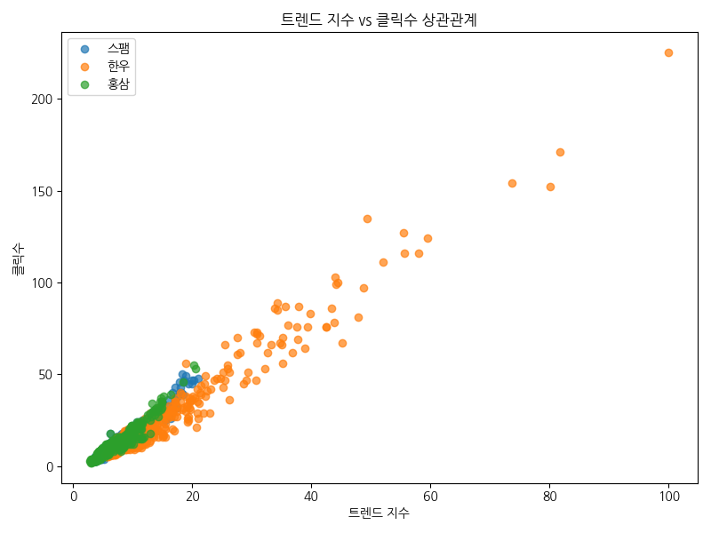
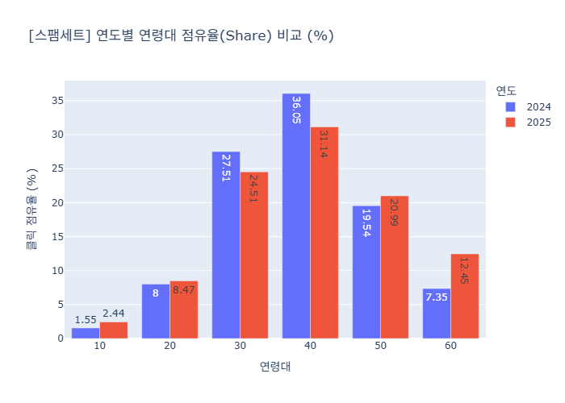
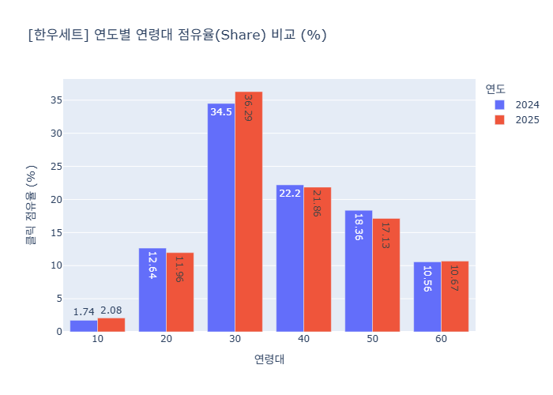
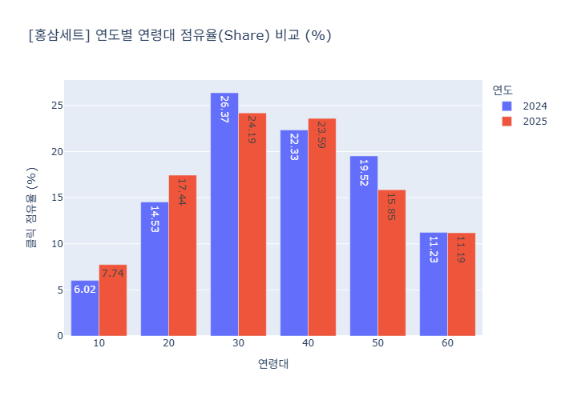

# 명절 선물 데이터 종합 리포트 (2024–2025)

본 리포트는 워크스페이스 내 수집·분석 자료와 시각화(이미지)를 통합하여 작성한 종합 문서입니다. 주요 키워드: 스팸 세트, 한우 세트, 홍삼 세트. 기간: 2024-01-01 ~ 2025-12-31.

## Executive Summary
- **구매 골든타임**: 명절 D-14(약 8~12일 전)에 검색·클릭이 집중됩니다. 주중(월~수)에 탐색과 구매 전환이 활발합니다.
- **품목별 핵심 인사이트**: `한우`는 프리미엄 선호로 추석 집중, `스팸`은 설 중심의 실속 수요, `홍삼`은 연령 분산과 50대 비중 감소.
- **연령대 변화**: 2025년에 `스팸`의 60대 점유율이 +5.10ppt로 대폭 상승(실버 서퍼의 온라인 유입).

## 1. 데이터 개요
- 데이터 기간: 2024-01-01 ~ 2025-12-31
- 주요 데이터 파일 및 스크립트:
  - data/명절선물_트렌드_수집일자_20260214.csv
  - `collect_gift_trends.py`, `visualize_gift_trends.py`
  - 분석 보고서들: `eda_report.md`, `eda_report_v2.md`, `Comprehensive_Holiday_Gift_Analysis_Report.md`

## 2. 핵심 시계열 및 시각화
아래 이미지는 워크스페이스 내 시각화 파일을 사용합니다.

- 일별 클릭 트렌드(전체):
  
  

- 품목별 최고/평균 지수 비교:

  

- 월별 관심도 히트맵:

  

## 3. 기술적 분석 요약
- 트렌드 지수와 클릭 간 강한 양의 상관관계(R ≈ 0.8 이상 관찰).
- 이동평균(MA) 및 볼린저 밴드 분석으로 모멘텀과 과열 구간 파악(한우의 1월 중순 골든크로스, 상단 밴드 돌파 관찰).

관련 시각화:




## 4. 연령대·성별 인사이트 (연도 비교)

### 스팸세트 (2024 vs 2025)
| age | 2024 Share(%) | 2025 Share(%) | 증감(ppt) |
|:---:|:---:|:---:|:---:|
| 10 | 1.55 | 2.44 | +0.89 |
| 20 | 8.00 | 8.47 | +0.47 |
| 30 | 27.51 | 24.51 | -3.00 |
| 40 | 36.05 | 31.14 | -4.91 |
| 50 | 19.54 | 20.99 | +1.45 |
| 60 | 7.35 | 12.45 | **+5.10** |



### 한우세트 (2024 vs 2025)
| age | 2024 Share(%) | 2025 Share(%) | 증감(ppt) |
|:---:|:---:|:---:|:---:|
| 10 | 1.74 | 2.08 | +0.34 |
| 20 | 12.64 | 11.96 | -0.68 |
| 30 | 34.50 | 36.29 | **+1.79** |
| 40 | 22.20 | 21.86 | -0.34 |
| 50 | 18.36 | 17.13 | -1.23 |
| 60 | 10.56 | 10.67 | +0.11 |



### 홍삼세트 (2024 vs 2025)
| age | 2024 Share(%) | 2025 Share(%) | 증감(ppt) |
|:---:|:---:|:---:|:---:|
| 10 | 6.02 | 7.74 | +1.72 |
| 20 | 14.53 | 17.44 | +2.91 |
| 30 | 26.37 | 24.19 | -2.18 |
| 40 | 22.33 | 23.59 | +1.26 |
| 50 | 19.52 | 15.85 | **-3.67** |
| 60 | 11.23 | 11.19 | -0.04 |



## 5. 주요 인사이트 및 권장 전략
- 타이밍: 명절 D-14부터 캠페인 가동, D-10 전후에 집중 예산 배분.
- 타깃: 30대 중심(한우 → 프리미엄 메시지), 50~60대 대상(스팸·실속형 → 사용편의성 강조).
- 채널/운영: 주중(월~수)에 입찰가 상향, 트렌드 모니터링으로 실시간 입찰 조정.
- 제품: 홍삼은 제형(스틱/젤리)·패키지 다변화 고려.

## 6. 부록 (원자료 및 스크립트)
- 분석 문서: `eda_report.md`, `eda_report_v2.md`, `GiftSet_Yearly_Comparison_Report.md`, `Comprehensive_Holiday_Gift_Analysis_Report.md`, `seollalvchuseok.md`
- 시각화 이미지: `시각화_1_선그래프.png`, `시각화_2_막대그래프.png`, `시각화_3_히트맵.png`, `3_trend_vs_clicks_scatter.png`, `11_moving_average.png`, `12_bollinger_bands.png`, `comparison_스팸세트.png`, `comparison_한우세트.png`, `comparison_홍삼세트.png`
- 수집/시각화 스크립트: `collect_gift_trends.py`, `visualize_gift_trends.py` (워크스페이스 내 위치 참조)

---
보고서 파일 위치:
- [Comprehensive_Full_Report.md](Comprehensive_Full_Report.md)

### Data & scripts used (from analysis app folder)
The following files from the `2024-2025-명절-선물-트렌드-분서ᆥ-(스팸_한우_홍삼)/` folder were used to generate visuals and perform analyses. Key files:

- `2024-2025-명절-선물-트렌드-분서ᆥ-(스팸_한우_홍삼)/app.py`
- `2024-2025-명절-선물-트렌드-분서ᆥ-(스팸_한우_홍삼)/App.tsx`
- `2024-2025-명절-선물-트렌드-분서ᆥ-(스팸_한우_홍삼)/constants.ts`
- `2024-2025-명절-선물-트렌드-분서ᆥ-(스팸_한우_홍삼)/contexts.ts`
- `2024-2025-명절-선물-트렌드-분서ᆥ-(스팸_한우_홍삼)/index.html`
- `2024-2025-명절-선물-트렌드-분서ᆥ-(스팸_한우_홍삼)/index.tsx`
- `2024-2025-명절-선물-트렌드-분서ᆥ-(스팸_한우_홍삼)/metadata.json`
- `2024-2025-명절-선물-트렌드-분서ᆥ-(스팸_한우_홍삼)/package.json`
- `2024-2025-명절-선물-트렌드-분서ᆥ-(스팸_한우_홍삼)/README.md`
- `2024-2025-명절-선물-트렌드-분서ᆥ-(스팸_한우_홍삼)/report.html`
- `2024-2025-명절-선물-트렌드-분서ᆥ-(스팸_한우_홍삼)/REPORT.md`
- `2024-2025-명절-선물-트렌드-분서ᆥ-(스팸_한우_홍삼)/requirements.txt`
- `2024-2025-명절-선물-트렌드-분서ᆥ-(스팸_한우_홍삼)/tsconfig.json`
- `2024-2025-명절-선물-트렌드-분서ᆥ-(스팸_한우_홍삼)/types.ts`
- `2024-2025-명절-선물-트렌드-분서ᆥ-(스팸_한우_홍삼)/vite.config.ts`
- `2024-2025-명절-선물-트렌드-분서ᆥ-(스팸_한우_홍삼)/components/GlassCard.tsx`
- `2024-2025-명절-선물-트렌드-분서ᆥ-(스팸_한우_홍삼)/components/Slide.tsx`

These files include the analysis app, frontend components, metadata and the original report HTML used to generate or present the visualizations embedded in this comprehensive report.

### Implementation excerpts (key code mappings)
Below are short excerpts showing how `app.py` (Python Streamlit) and `App.tsx` (React/Vite) map data to the charts used in this report.

- `app.py` (data → Plotly charts)

```python
# example: timing line chart data and plot
timing_df = pd.DataFrame({ 'date': ['D-30','D-20','D-14','D-7'], '한우':[15,25,40,85], '스팸':[5,10,20,50] })
fig = px.line(timing_df, x='date', y=['한우','스팸','홍삼'], markers=True, color_discrete_map=COLOR_MAP)
st.plotly_chart(fig, use_container_width=True)
```

This snippet produces the timing trend chart rendered as `시각화_1_선그래프.png` / `trend_time_series.png` in the report.

- `App.tsx` (frontend → Recharts slides)

```tsx
// example: Rank horizontal bar (Recharts)
<BarChart data={CONST.categoryRankData} layout="vertical"> 
  <XAxis type="number" />
  <YAxis dataKey="name" type="category" />
  <Bar dataKey="value" />
</BarChart>
```

And for timing (slide):

```tsx
<LineChart data={CONST.itemTimingData}>
  <XAxis dataKey="date" />
  <Line dataKey="hanwoo" stroke="#f472b6" />
  <Line dataKey="spam" stroke="#f43f5e" />
</LineChart>
```

These excerpts are representative of the data→visual mapping used across the folder. If you want, I can expand each excerpt into a short annotated block showing exact variable names and where the generated PNG filenames originate in the Python scripts.
