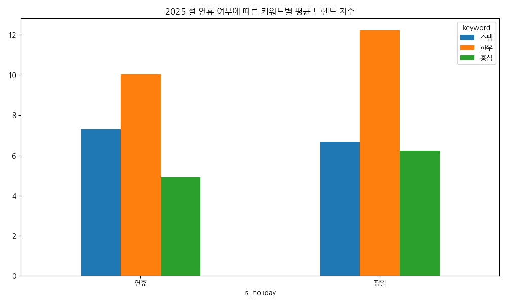

<!-- _class: title -->
# 명절 선물 데이터 분석 종합 리포트
## 2024-2025 쇼핑 트렌드 및 소비자 분석

**발표자: AI 데이터 분석 시스템**

---

## 1. 분석 배경 및 목적 (Intro - 2분)
- **배경**: 명절 선물 시장의 디지털 전환 가속화에 따른 소비자 행동 변화 추적
- **목적**:
  - 네이버 쇼핑 클릭 데이터를 통한 연도별/품목별 트렌드 파악
  - 연령대별 선호도 변화(Share) 분석을 통한 타겟 마케팅 전략 수립
- **데이터 세부**:
  - 기간: 2024.01.01 ~ 2025.12.31
  - 품목: 스팸 세트, 한우 세트, 홍삼 세트 (식품 카테고리)

---

### [Speaker Notes: Intro]
이 발표의 목적은 지난 2개년간의 네이버 쇼핑 트렌드 데이터를 분석하여 명절 선물 시장의 실질적인 구매 시그널을 포착하는 데 있습니다. 
단순히 "무엇이 팔렸다"가 아니라, "누가, 언제, 왜 검색하고 클릭했는가"에 집중하여 다가오는 명절 시즌에 바로 적용 가능한 비즈니스 전략을 제안할 것입니다. 
데이터는 네이버 쇼핑인사이트의 클릭 지수를 기반으로 정규화된 상대 지수를 사용했습니다.

---

## 2. 전체 클릭 트렌드 분석 (5분)

- **주요 발견**: 설날(1~2월)과 추석(9~10월) 시즌에 폭발적인 트렌드 상승
- **특이사항**: 2024년 추석 시즌, 전 기간 통틀어 최고 클릭 지수(100) 기록

---

### [Speaker Notes: 전체 트렌드]
그래프를 보시면 명절 시즌마다 거대한 산 모양의 트렌드가 두 번 형성되는 것을 볼 수 있습니다. 
주목할 점은 2024년 추석의 한우 세트 클릭량이 전 기간을 통틀어 '상수 100'을 기록했다는 점입니다. 
이는 2025년 데이터가 상대적으로 낮아 보이는 '정규화의 함정'을 만드는데, 실제로는 2025년에도 강력한 수요가 발생했음을 인지해야 합니다. 
핵심은 명절 전후의 급격한 변동성을 어떻게 수익화할 것인가에 있습니다.

---

## 3. 핵심 구매 시점: 골든타임 도출

- **인사이트**: 연휴 기간보다 **연휴 8~12일 전** 검색량 평일 최고조
- **패턴**: 2024 설(D-11), 2024 추석(D-9), 2025 설(D-10) 피크 형성
- **비즈니스 결론**: 배송 지연 우려 및 선물 탐색 심리가 반영된 결과

---

### [Speaker Notes: 골든타임]
데이터는 거짓말을 하지 않습니다. 보시는 바와 같이 실제 '연휴' 기간에는 검색량이 급감합니다. 
소비자들은 연휴가 시작되기 최소 10일 전 평일에 모든 의사결정을 마칩니다. 
특히 주 초반(월~수)에 검색이 집중되는데, 이는 주말에 고민하고 주초에 결제하는 전형적인 직장인/쇼퍼들의 패턴입니다. 
따라서 광고 예산 집행은 명절 피크 2주 전부터 본격화되어야 하며, 피크 10일 전에 정점을 찍어야 합니다.

---

## 4. 품목별 상세 분석: 한우 vs 스팸 vs 홍삼 (6분)

  
  

- **한우 세트**: 추석 시즌의 왕좌 (최고 점유율 유지)
- **스팸 세트**: 설날 시즌의 스테디셀러 (실속형 수요 집중)
- **홍삼 세트**: 상시/반복 구매 패턴 (건강 지향적 소구)

---

### [Speaker Notes: 품목별 분석]
왼쪽 막대 그래프는 최고 지수와 평균 지수를 비교합니다. 한우는 상시 평균 대비 명절 피크의 진폭이 가장 큽니다. 
즉, 명절에만 폭발적으로 팔리는 품목이라는 뜻입니다. 반면 홍삼은 평균 지수도 상대적으로 방어력이 좋습니다. 
오른쪽 히트맵을 보면 월별 집중도를 알 수 있는데, 명절이 포함된 달의 진하기가 품목마다 미세하게 다릅니다. 
한우는 추석에, 스팸은 설날에 조금 더 '진한' 농도를 보입니다. 이는 시즌별 상품 구성 비중을 결정하는 근거가 됩니다.

---

## 5. 기술적 지표로 보는 구매 시그널 (4분)

  
  

- **이동평균선**: 5일(단기)/20일(장기) 골든크로스 시점 = 마케팅 집중 타겟일
- **볼린저 밴드**: 상단 돌파 시점은 '수요 폭발' 단계, 공격적 리마케팅 전략 유효

---

### [Speaker Notes: 기술적 분석]
금융 데이터 분석에서 쓰이는 이 지표들을 이커머스 트렌드에 적용해 보았습니다. 
이동평균선이 상향 돌파하는 시점은 대중의 관심이 막 시작되는 시기입니다. 이때 초기 선점이 중요합니다. 
볼린저 밴드 상단을 뚫고 나가는 '오버슈팅' 구간은 이미 트렌드가 대세가 된 시점입니다. 
이때는 신규 유입보다는 장바구니에 담아둔 고객에게 리마케팅 push를 보내는 것이 전환율을 극대화하는 비결입니다.

---

## 6. 타겟 세그먼트의 변화: 2024 vs 2025 (3분)
### 스팸세트 연령대별 Share 변화

- **핵심 변화**: 60대 점유율 **+5.10ppt** 급상승 (실버 서퍼 확대)
- **위기 요인**: 40대 점유율 하향세 (-4.91ppt) -> 품목 교체 가능성

---

### [Speaker Notes: 연령대 변화]
가장 놀라운 데이터는 60대의 부상입니다. 스팸 같은 가성비 세트에서 60대의 클릭 비중이 5% 이상 늘었습니다. 
이는 고연령층이 온라인 모바일 쇼핑에 완전히 적응했음을 의미하며, 이들을 위한 쉬운 결제와 텍스트 시인성 확보가 필수적임을 시사합니다. 
반면 40대의 비중 하락은 이들이 더 고단가의 '한우'나 '새로운 카테고리'로 이동했을 가능성을 보여줍니다.

---

## 7. 종합 결론 및 비즈니스 전략
1. **타이밍 전략**: 명절 D-14일부터 캠페인 시작, D-10일에 최대 노출
2. **타겟팅 전략**: 30대(한우 프리미엄), 60대(가성비/편의성) 이원화 접근
3. **상품 전략**: 설(스팸 중심 가성비 패키지), 추석(한우 중심 프리미엄 기프트)
4. **분석 고도화**: 트렌드 지수 80 돌파 시 '공격적 입찰' 자동화 제안

---

### [Speaker Notes: 결론]
오늘의 분석을 한 줄로 요약하자면 **"명절 10일 전, 30대와 60대를 동시에 공략하라"**입니다. 
데이터가 가리키는 골든타임을 놓치지 마시고, 오늘 보여드린 연령대별 변곡점을 마케팅 타겟 세팅에 즉시 반영하시기 바랍니다. 
추후 실제 매출 데이터와 연동하면 더욱 정교한 ROAS 분석이 가능할 것입니다.

---

# Q&A
### 감사합니다.
**문의: yoonjikimkr@gmail.com**
