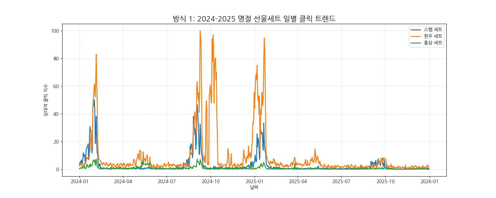
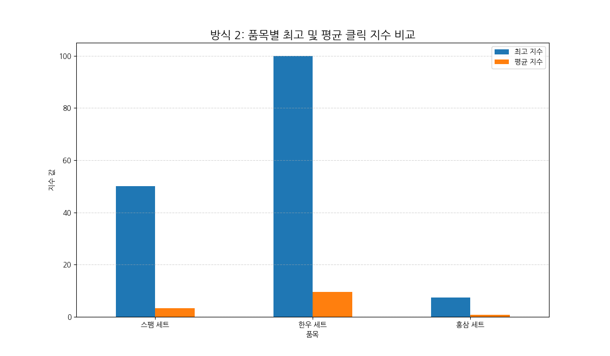
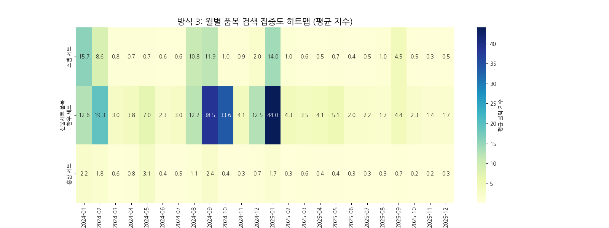
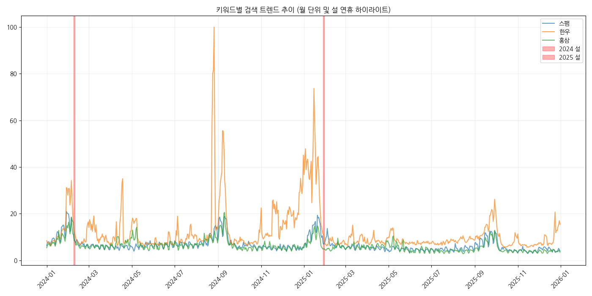
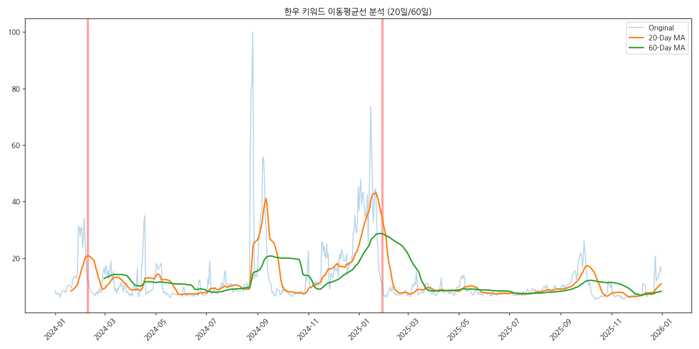
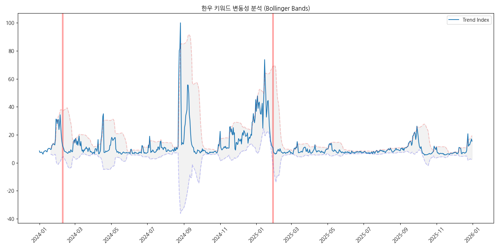

# 명절 선물 데이터 분석 종합 리포트
### 2024-2025 쇼핑 트렌드 및 소비자 분석

---

## 1. 명절 선물세트 쇼핑 트렌드 개요
- **분석 품목**: 스팸 세트, 한우 세트, 홍삼 세트
- **데이터 출처**: 네이버 쇼핑 클릭 트렌드 (2024-2025)
- **핵심 패턴**: 명절 8~12일 전 구매 정점(Peak) 도달

---

## 2. 품목별 클릭 트렌드 (1)

- 설/추석 시즌 전후로 검색량 및 클릭량이 급격히 상승하는 패턴 확인

---

## 3. 품목별 클릭 트렌드 (2)

  
  

- **한우**: 추석 시즌 압도적 선호 (최고 지수 100)
- **스팸**: 설날 시즌 상대적 강세, 안정적 수요의 스테디셀러

---

## 4. 상세 EDA: 검색 및 상관관계

- **상관성**: 검색 트렌드 지수와 클릭수 간 **강한 양의 상관관계**
- 특히 '한우'는 검색이 실제 구매 고려(클릭)로 즉각 연결됨

---

## 5. 상세 EDA: 기술적 분석

  
  

- **이동평균선**: 1월 중순 강력한 구매 모멘텀 형성
- **볼린저 밴드**: 특정 시점 '오버슈팅' 발생 (집중 관심 구간)

---

## 6. 연령대별 구성비 분석: 스팸세트
**60대 실버 서퍼의 온라인 유입 확대 (+5.10ppt)**

| age | 2024 (%) | 2025 (%) | 증감(ppt) |
|:---:|:---:|:---:|:---:|
| 10/20 | 9.55 | 10.91 | +1.36 |
| 30/40 | 63.56 | 55.65 | -7.91 |
| 50/60 | 26.89 | 33.44 | **+6.55** |

- 전통적 3040 세대에서 고연령층으로 외연 확장 중

---

## 7. 연령대별 구성비 분석: 한우 & 홍삼
- **한우세트**: **30대(36.29%)**의 독보적 지지, 프리미엄 시장 핵심 타겟
- **홍삼세트**: 50대 비중 감소(-3.67ppt), 건강기능식품 시장 다변화 시사

---

## 8. 종합 결론 및 마케팅 제언
1. **한우 & 30대 집중**: 추석 시즌 30대 타겟 프리미엄 마케팅 주효
2. **D-14 평일 공략**: 명절 2주 전 평일(월~수)이 검색/클릭 골든타임
3. **고연령층 편의성 강화**: 5060대의 온라인 구매 비중 증가에 따른 UI/UX 대응 필요
4. **품목별 시즌 전략**: 설날(실속형), 추석(고급형) 차별화된 프로모션

---

# Q&A
감사합니다.
